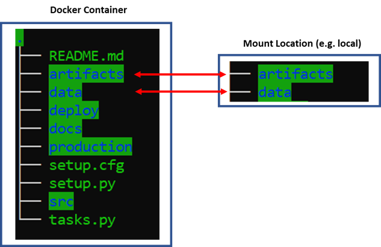

.. _Deployment Guide:

=========================
Deployment Guide
=========================

It covers procedure to run the pet recognition processes through Docker container.

1. Data Storage Connection
---------------------------

Docker image contains the whole pet visual codebase which have source codes folder along with data and artifacts folder.
Instead of maintaining any data within the Docker, we need to mount these (``data`` & ``artifacts``) folders to the same structured folder in the local.

Mounting will allows docker to read from and write to the Mount location.

2. Running Docker Container
----------------------------

Execute following command in the terminal to run docker container::

    docker run -it \
    -v <path to data folder outside docker>:/cat_image_recognition/data/  \
    -v <path to artifacts folder outside docker>:/cat_image_recognition/artifacts/ \
    -p 8888:8888 \
    -t 1473a344d9b8 \
    /bin/bash

The above command runs docker container in interactive mode.
Also, port mapping is specified so that jupyter lab server is accessible from outside the container

3 Run Processes
---------------------------------
There are 2 ways as mentioned in modeling guide section, to run the processes inside Docker:

1. Through production script::

        (base):~/<proj-folder>$ conda activate npp-pet-id-dev
        (npp-pet-id-dev):~/<proj-folder>$ python production/test.py [enroll | inference | train-effnet | train-yolo]

2. Through invoke tool::

        (base):~/<proj-folder>$ inv run.[enroll | inference | train-effnet | train-yolo]

4. Using Jupyter Lab
--------------------

Jupyter lab can be run inside container and it can be accessed outside the container on port 8888.

Run the following commands to start jupyter lab inside container::

        (base):~$ conda activate npp-pet-id-dev
        (npp-pet-id-dev):~$ jupyter-lab --ip=0.0.0.0 --port=8888 --no-browser --allow-root

