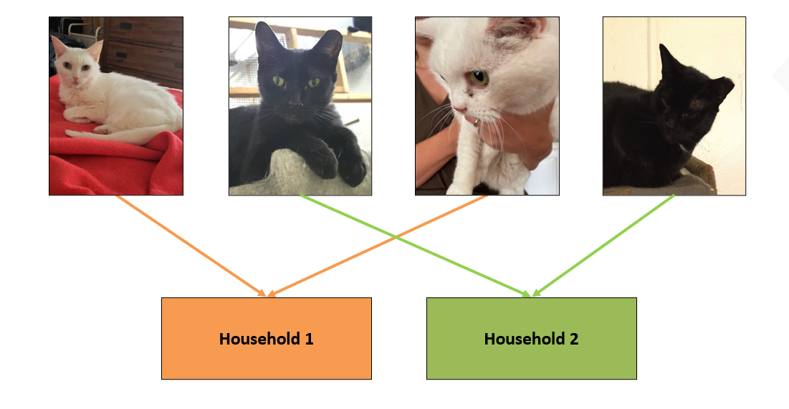
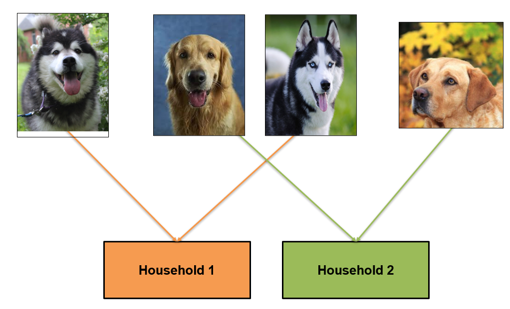

.. _Model Evaluation:

===================
Model Results
===================

1. Pipeline Results
======================================

1.1 Face Detection - Pet Type Prediction
----------------------------------------

**1.1.1 Face Detection Summary**

=====================  ========
Detection Type          #Images
=====================  ========
Single Face Detection     51930
No Face Detection          3251
Multi-Face Detection       2493
=====================  ========

.. note::
    Multi-Face detections are ignored for the pipeline evaluation because actual pet id is not provided for all the pets in the image.
    So, with that our evaluation would be on 55,181 images(Single-Face and No-Face Detection).

**1.1.2 Confusion Matrix**

+------------+----------------+--------------+-------------------+
|            |  Predicted Cat | Predicted Dog|  Predicted Others |
+============+================+==============+===================+
|Actual Cat  |        27,859  |         142  |           1,797   |
+------------+----------------+--------------+-------------------+
|Actual Dog  |           10   |     23,919   |           1,454   |
+------------+----------------+--------------+-------------------+

.. note::
    As there is no pet class other than cat and dog in the data, it is not shown against the actuals.

**1.1.3 Classification Report**

========= ================== ======== ========= ========= ======== ===========  ==============
Category  Precision          Recall   F1-Score  Accuracy  Support   Pet Count   House Count
========= ================== ======== ========= ========= ======== ===========  ==============
Overall   99.70%              93.83%   96.68%   93.83%     55,181    30,789         6,528
Cat       100%                93.49%   96.63%   93.49%     29,798    14,378         5,705
Dog       100%                94.23%   97.03%   94.23%     25,383    16,411         6,524
========= ================== ======== ========= ========= ======== ===========  ==============

1.2. Face Recognition - Pet ID Prediction
-----------------------------------------

The evaluation of Face Recognition step is done on the images where we detected single face from the previous step i.e. on 51,930 images.

**1.2.1 Classification Report**

========  ==========  ========  ==========  =========  =========  ==========  ============
category   Precision    Recall    F1-Score   Accuracy    Support   Pet Count   House Count
========  ==========  ========  ==========  =========  =========  ==========  ============
overall     95.85%      95.91%    95.33%      95.91%     51,930      30,180      6,528
cat         95.80%      95.34%    94.94%      95.34%     28,001      14,199      5,702
dog         96.24%      96.58%    95.99%      96.58%     23,929      15,981      6,517
========  ==========  ========  ==========  =========  =========  ==========  ============

**1.2.2 Classification Report by Pets Per House Combinations**

+---------+----------------+----------+--------+---------+---------+--------+----------+--------------+
| pet type|  pets per house| Precision|  Recall| F1-Score| Accuracy| Support| Pet Count| House Count  |
+=========+================+==========+========+=========+=========+========+==========+==============+
|         |   **2**        | 97.04%   |96.52%  | 96.29%  |  96.52% |13,905  |   7,037  |     3,603    |
|         +----------------+----------+--------+---------+---------+--------+----------+--------------+
|    cat  |   **3**        | 95.57%   |95.23%  | 94.77%  |  95.23% | 6,216  |   3,160  |     1,078    |
|         +----------------+----------+--------+---------+---------+--------+----------+--------------+
|         |   **4+**       | 93.79%   |93.35%  | 92.71%  |  93.35% | 7,880  |   4,002  |     1,021    |
+---------+----------------+----------+--------+---------+---------+--------+----------+--------------+
|         |   **2**        | 97.16%   |97.43%  | 96.99%  |  97.43% |11,852  |   7,907  |     4,106    |
|         +----------------+----------+--------+---------+---------+--------+----------+--------------+
|    dog  |   **3**        | 95.84%   |96.28%  | 95.60%  |  96.28% | 5,333  |   3,598  |     1,244    |
|         +----------------+----------+--------+---------+---------+--------+----------+--------------+
|         |   **4+**       | 94.95%   |95.32%  | 94.54%  |  95.32% | 6,744  |   4,476  |     1,167    |
+---------+----------------+----------+--------+---------+---------+--------+----------+--------------+

**1.2.3 Classification Report by number of enrolled images**

=======================  ==========  ========  ==========  =========  ========  =========  ===========
enrolled images per pet   Precision    Recall    F1-Score   Accuracy   Support  Pet Count  House Count
=======================  ==========  ========  ==========  =========  ========  =========  ===========
**(0, 2]**                 95.19%     94.49%      94.34%     94.49%    20,056     14,506        6,209
**(2, 4]**                 97.85%     96.80%      96.89%     96.80%    31,641     15,613        6,183
**>4**                     99.18%     97.85%      98.38%     97.85%       233         61           54
=======================  ==========  ========  ==========  =========  ========  =========  ===========

2. Edge Cases Testing Results
==============================
The data used for these experiments is different from the above pipeline data.
Specific meta-information like color and breed are collected while scraping the images.

2.1 For Same Color Households
-----------------------------
Same color pets were grouped together in households.

**2.1.1 Data Distribution**

============  ===========  ================  ===============  ===============
Category       #images      #unique colors   #train images    #test images
============  ===========  ================  ===============  ===============
Cat              16,382               30            8,402       7,980
Dog            1,44,425               15           73,136      71,289
============  ===========  ================  ===============  ===============

**2.1.2 Classification Report**

============  ===========  ========  ==========  ==========  =========
Category       Precision    Recall    F1-Score    Accuracy    Support
============  ===========  ========  ==========  ==========  =========
Cat            93.79%       93.54%     92.78%      93.54%       7,980
Dog            92.39%       92.33%     91.38%      92.33%      71,289
============  ===========  ========  ==========  ==========  =========

**2.1.3 Cat Color wise Report**

Showing for top 12 cat color categories having maximum number of images.

========================  =========  ======  ========  ========  =======  =========  ===========
 color                    Precision  Recall  F1-Score  Accuracy  Support  Cat count  House Count
========================  =========  ======  ========  ========  =======  =========  ===========
 Black                    92.01%     91.69%  90.80%    91.69%      2,264     1,037         460
 Gray & White             95.09%     95.12%  94.44%    95.12%      1,744       809         353
 Calico                   95.82%     95.39%  94.91%    95.39%      1,346       611         270
 Dilute Calico            97.13%     97.46%  97.09%    97.46%        315       137          62
 Dilute Tortoiseshell     94.05%     91.91%  91.78%    91.91%        272       123          52
 Buff & White             95.93%     95.25%  94.82%    95.25%        232       105          47
 White                    96.99%     95.89%  95.44%    95.89%        195        88          37
 Tortoiseshell            96.38%     95.37%  95.12%    95.37%        173        80          34
 Black & White / Tuxedo   87.96%     88.97%  86.95%    88.97%        127        63          27
 Brown / Chocolate        82.41%     83.06%  80.57%    83.06%        124        56          23
 Gray / Blue / Silver     91.20%     92.24%  90.76%    92.24%        116        54          23
 Orange & White           95.6 %     95.00%  94.4 %    95.00%        100        50          22
========================  =========  ======  ========  ========  =======  =========  ===========

**2.1.4 Dog Color wise Report**

Showing for top 12 dog color categories having maximum number of images.

==================================  =========  ======  ========  =========  =======  =========  ===========
   color                            Precision  Recall  F1-Score   Accuracy  Support  Dog count  House Count
==================================  =========  ======  ========  =========  =======  =========  ===========
 Black                              92.84%     92.78%  91.89%     92.78%     18,425     9,538        4,260
 White / Cream                      92.17%     92.32%  91.32%     92.32%     10,616     5,376        2,384
 Brown / Chocolate                  93.34%     93.04%  92.26%     93.04%      7,876     4,013        1,774
 Yellow / Tan / Blond / Fawn        90.44%     90.40%  89.21%     90.40%      6,960     3,537        1,563
 Tricolor (Brown, Black, & White)   93.75%     94.00%  93.11%     94.00%      5,922     3,089        1,366
 Brindle                            91.87%     91.53%  90.50%     91.53%      4,915     2,508        1,098
 Gray / Blue / Silver               91.65%     91.64%  90.60%     91.64%      4,117     2,070          916
 Red / Chestnut / Orange            91.57%     91.56%  90.52%     91.56%      3,855     1,951          861
 Bicolor                            93.86%     93.65%  92.92%     93.65%      3,028     1,614          714
 Apricot / Beige                    91.88%     91.69%  90.58%     91.69%      2,614     1,348          594
 Golden                             89.96%     89.92%  88.68%     89.92%      1,767       928          406
 Merle (Blue)                       93.69%     93.52%  92.55%     93.52%        417       227           99
==================================  =========  ======  ========  =========  =======  =========  ===========

2.2 For Same Breed Households
-----------------------------
Same breed pets were grouped together in households.

For Cat, we found 25,183  images over 30 different breed categories.
For Dog, we found 2,16,495 test images over 218 different breed categories.

**2.2.1 Data Distribution**

============  ===========  ================  ===============  ===============
Category       #images      #unique breeds   #train images    #test images
============  ===========  ================  ===============  ===============
Cat              25,183               48           12,790          12,393
Dog            2,16,495              218         1,10,067        1,06,428
============  ===========  ================  ===============  ===============

**2.2.2 Classification Report**

============  ===========  ========  ==========  ==========  =========
Category       Precision    Recall    F1-Score    Accuracy    Support
============  ===========  ========  ==========  ==========  =========
Cat             95.36%      95.19%    94.64%      95.19%       12,393
Dog             91.35%      91.47%    90.34%      91.47%     1,06,428
============  ===========  ========  ==========  ==========  =========

**2.2.3 Cat Breed wise Report**

Showing for top 12 cat breeds having maximum number of images.

======================  =========  ======  ========  ========  =======  ============  ==============
Breed                   Precision  Recall  F1-Score  Accuracy  Support   Cat count     House Count
======================  =========  ======  ========  ========  =======  ============  ==============
Domestic Short Hair      95.82%    95.47%   95.05%    95.47%      2762        1,293            570
Tabby                    95.13%    95.00%   94.46%    95.00%      2462        1,129            495
Domestic Medium Hair     98.45%    98.38%   98.20%    98.38%      2223        1,005            439
Calico                   94.45%    94.73%   94.00%    94.73%       684          286            122
Tuxedo                   93.37%    93.49%   92.57%    93.49%       676          308            138
American Shorthair       96.45%    96.21%   95.64%    96.21%       555          256            111
Siamese                  94.83%    95.03%   94.33%    95.03%       544          233            104
Tortoiseshell            91.84%    92.23%   90.81%    92.23%       438          195             82
Domestic Long Hair       97.05%    97.23%   96.86%    97.23%       289          133             59
Maine Coon               97.40%    96.74%   96.51%    96.74%       215           90             40
Russian Blue             90.16%    88.35%   87.11%    88.35%       189           88             40
Tiger                    91.27%    90.16%   89.47%    90.16%       183           74             31
======================  =========  ======  ========  ========  =======  ============  ==============

**2.2.4 Dog Breed wise Report**

Showing for top 12 dog breeds having maximum number of images.

===============================  ===========  ========  ==========  ==========  =========  ===========  =============
Breed                              Precision    Recall    F1-Score   Accuracy    Support   Dog count    House Count
===============================  ===========  ========  ==========  ==========  =========  ===========  =============
Pit Bull Terrier                   92.65%       92.67%    91.72%     92.67%       14,464     7,773         3,424
Labrador Retriever                 90.45%       90.71%    89.45%     90.71%       11,185     6,166         2,735
Mixed Breed                        93.56%       93.81%    92.88%     93.81%        8,797     4,914         2,169
Terrier                            94.85%       94.90%    94.24%     94.90%        5,414     2,928         1,291
American Staffordshire Terrier     91.83%       91.80%    90.73%     91.80%        4,785     2,447         1,082
Chihuahua                          91.31%       91.40%    90.36%     91.40%        4,481     2,599         1,168
Shepherd                           91.72%       91.92%    90.80%     91.92%        4,311     2,435         1,083
German Shepherd Dog                91.23%       91.28%    90.08%     91.28%        4,292     2,383         1,090
Hound                              93.18%       93.04%    92.16%     93.04%        3,710     2,031           888
Boxer                              92.73%       92.84%    91.85%     92.84%        3,508     1,849           810
American Bulldog                   90.78%       91.23%    89.93%     91.23%        2,156     1,173           514
Beagle                             91.31%       91.03%    89.98%     91.03%        1,819     1,041           454
===============================  ===========  ========  ==========  ==========  =========  ===========  =============

