========================
Modeling Guide
========================

Modeling guide covers following details:

    - Project configuration settings
    - Procedure to enroll a new pet in the system
    - Infer pet IDs from unseen images of enrolled pets
    - Train the pipeline models (EfficientNetB2 and YOLOv5)
    - Procedure to scrape data from Petfinder

1. Project Configuration
========================

All the project configuration files are available under ``production/conf`` directory.

Following is the config directory structure:

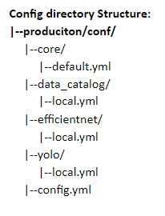

Brief explanation

- ``core`` - Core config that sets base paths for the data and artifacts folder

- ``data_catalog`` - Contains the raw and processed data paths for enroll, inference and training(efficientnet and yolo models) data.

- ``efficientnet`` - Contains the scoring and training configurations for efficientNetB2 model.

- ``yolo`` - Contains the scoring and training configurations for YOLOv5 model.

- ``config.yml``  - The parent config file that points to all above configuration files. This is used to create the project configuration object.

.. _Enrollment:

2. Enrollment
========================

2.1 Overview
------------------------

Enrollment is the process of adding a new pet to the system. This is accomplished by creating feature vectors(embeddings) and storing it in the database.

Following details are required to enroll pet in the system
    - House ID
    - Pet name
    - Pet type(cat or dog)
    - At least 4 images with face clearly visible. (set through ``min_imgs_required`` in ``data_catalog/local.yml``)

For a given pet image, the face gets detected and cropped and embeddings are generated. Post which  mean of embeddings are computed and stored.

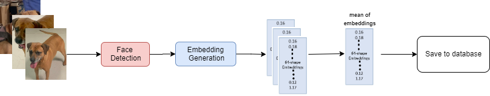

2.2 Raw Data Structure
------------------------

The raw enroll image data needs to be organized as follows.

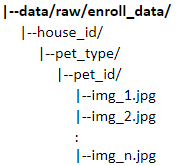

2.3 Procedure
------------------
Reference function to run the enrollment process for all households : :py:func:`run_enrollment <process.run_enrollment>`

Following are the steps for enrollment:

2.3.1 Metadata creation from the raw image data
^^^^^^^^^^^^^^^^^^^^^^^^^^^^^^^^^^^^^^^^^^^^^^^^^^^^^^^^^

An image level metadata is created by iterating through all the pet's images across all the houses in the given raw data.
For each image the metadata contains information about house name, pet name, pet type and  image path.
Following is the sample snapshot of the enroll metadata.

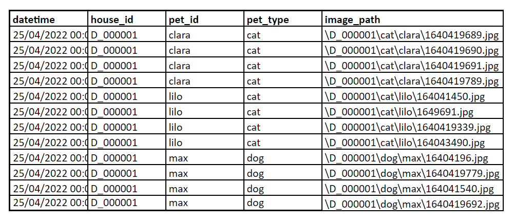

Function to prepare the enroll metadata ::py:func:`prep_enroll_data <ta_pet_id.data_prep.core.prep_enroll_data>`

2.3.2 Pet Database Creation
^^^^^^^^^^^^^^^^^^^^^^^^^^^^^^^^^^^^^^^^^^^^^^^^^^^^^^^^^

First face is detected in all the images through YOLOv5 model.
Then for each pet we consider at least 4 images for which face is detected and pass those to efficientNetB2 model to get the feature vector (embedding)
A pet database(pet_db.csv) is created which stores name, type, embedding for a particular pet.
Further, for each pet we take mean of the feature vector and store it as a pet's profile in the pet database.

Below is the sample snapshot of the enrolled pet database

.. image:: images/modeling_guide/pet_db.png
   :width: 80%

Following function is run on each house to get pet DB ::py:func:`enroll_pet <ta_pet_id.pipeline.main.enroll_pet>`

2.4 How to Run
------------------

To run through production script (from ``npp-pet-id-dev`` env)::

    (npp-pet-id-dev):~/<proj-folder>$ python production\test.py enroll 0

To run through invoke tool (from ``base`` env)::

    (base):~/<proj-folder>$ inv run.enroll --re-enroll=False

3. Inference
========================

3.1 Overview
------------------------
Inference is the process for predicting pet ID for a given pet image by comparing it against the existing enrolled pets in the system.

To infer the pet ID for the given pet's image, house ID of the pet would be required
so that it can be compared against the pet within the house only and not against all the pets in the system.

For the given pet image face gets detected and cropped then the embeddings are generated.
Post which similarity distances between the embeddings are computed against all the enrolled pets of predicted pet type in the house.
The pet ID predicted would be the pet having minimum similarity distance.

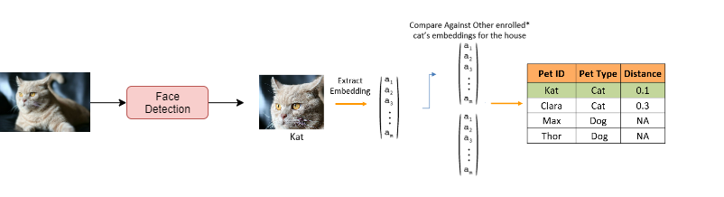

3.2 Raw Data Structure
----------------------

The raw inference image data needs to be organized as follows.

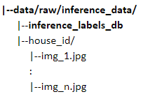

For development purpose an optional label file(``inference_labels_db``) that contains the actual pet type and pet id can be provided along with the images in order to evaluate the model.

3.3 Procedure
----------------------

Reference function to run inference process ::py:func:`run_inference <process.run_inference>`

Following are the steps for inference:

3.3.1 Metadata creation from the raw image data
^^^^^^^^^^^^^^^^^^^^^^^^^^^^^^^^^^^^^^^^^^^^^^^^

An image level metadata is created by iterating through all the pet's images across all the houses in the given raw data.
For each image the metadata contains information about house name and image path.
Following is the sample snapshot of the enroll metadata.

If label file with true labels(**pet_id** and **pet_type**) is provided, then this information is also stored in the inference database.

Below is the sample snapshot of the enrolled pet database

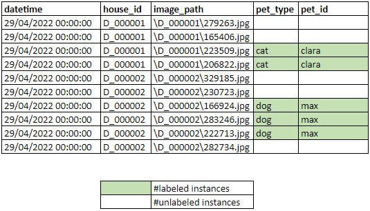

Function to prepare the enroll metadata ::py:func:`prep_inference_data <ta_pet_id.data_prep.core.prep_inference_data>`

3.3.2 Run inference
^^^^^^^^^^^^^^^^^^^^^^^^^^^^^^^^^^^^

First face is detected in all the images through YOLOv5 model. Then cropped face is passed to EfficientNetB2 model to get feature vectors(embeddings).
The image with no face detection are not considered for embedding generation.
Now the embeddings are compared against the embeddings of pets stored in pet embedding database for that particular household.

A new metafile is created by appending the predicted pet type and predcted pet id to the existing
inference metadata.
Following is the sample snapshot of the metadata.

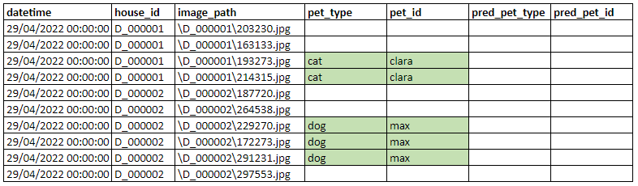

Function used for inference ::py:func:`infer_pet_id <ta_pet_id.pipeline.main.infer_pet_id>`

3.3.3 Evaluation Report
^^^^^^^^^^^^^^^^^^^^^^^^^^^^^^^^^^^^

If we have **pet_id** and **pet_name** information present in ``inference_labels_db``, we use them as true labels and generate reports on our predictions.

Report is generated for pipeine as shown in  :ref:`Model Evaluation` section

- Under Face Detection, classification report and confusion matrix for pet type classifications are generated.
- Under Face Recognition, classification report for pet id classification is  generated.

3.4 How to Run
------------------

To run through production script (from ``npp-pet-id-dev`` env)::

    (npp-pet-id-dev):~/<proj-folder>$ python production\test.py inference

To run through invoke tool (from ``base`` env)::

    (base):~/<proj-folder>$ inv run.inference

4. Training
============================

This section covers the procedure for training YOLOv5 and efficientNetB2 models.

4.1 Training EfficientNetB2
-------------------------------

4.1.1 Input Data Structure
^^^^^^^^^^^^^^^^^^^^^^^^^^^^^^^^^^^

The raw input data needs to be organized as follows.

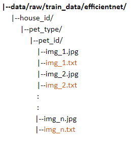

4.1.2 Procedure
^^^^^^^^^^^^^^^^^^^^^^^^^^^^^^^^^^^

4.1.2.1 Create Metadata
""""""""""""""""""""""""
Metadata is created from imagedata in the above structure.
Function used to create train metadata: :py:func:`prep_efficientnet_train_metadata <ta_pet_id.data_prep.core.prep_efficientnet_train_metadata>`

4.1.2.2 Training
""""""""""""""""""""""""

Once imagedata and metadata are ready, following function is used to train YOLOv5 model.
:py:func:`train_efficientnet_model <process.train_efficientnet_model>`

Trained model will be saved at this location: ``artifacts/efficientnet/<version number>/model/``

4.1.3 How to Run
^^^^^^^^^^^^^^^^

To run through production script (from ``npp-pet-id-dev`` env)::

    (npp-pet-id-dev):~/<proj-folder>$ python production\test.py train-effnet

To run through invoke tool (from ``base`` env)::

    (base):~/<proj-folder>$ inv run.train-effnet

4.2 Training YOLOv5
-----------------------------

For training yolo, the truth label for each image should be provided in the text file with same name as of image.
The text file should contain class (pet type) and face location (x_center, y_center, width, height) as shown below:

To understand more and prepare the truth labels for training YOLO, refer here https://github.com/ultralytics/yolov5/wiki/Train-Custom-Data#1-create-dataset

4.2.1 Input Data Structure
^^^^^^^^^^^^^^^^^^^^^^^^^^^^^^^^^^^^

Raw image data can be provided in any of the following formats.

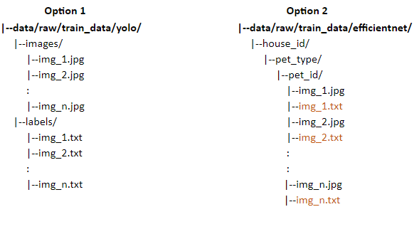

Option-1 is the standard format require for training the YOLO.

Option-2 is same as of training data for EfficientNet which additionally having the text files for ground truths for each image.
If data is provided in this format it needs to be converted in YOLO's standard format i.e. option-1
and the same can be done by this helper utility :py:func:`prep_yolo_data_from_hh <ta_pet_id.data_prep.core.prep_yolo_data_from_hh>`

4.2.2 Procedure
^^^^^^^^^^^^^^^^^^^^^^^^

4.2.2.1 Create Metadata
"""""""""""""""""""""""""
Metadata is created from imagedata in the above structure.

Sample snapshot of the created metadata

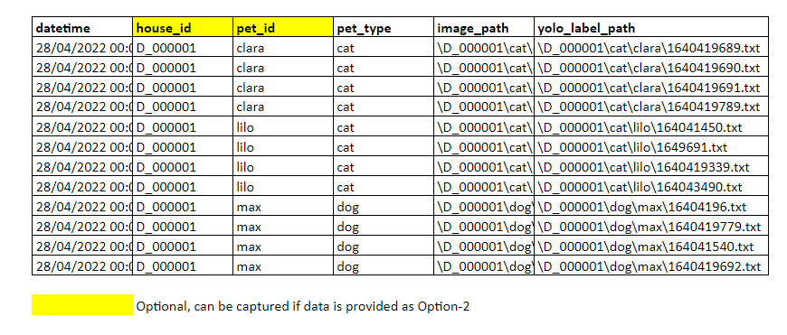

Function used to create train metadata: :py:func:`prep_yolo_train_metadata <ta_pet_id.data_prep.core.prep_yolo_train_metadata>`

4.2.2.2 Training
"""""""""""""""""""""""""

Once imagedata and metadata are ready, following function is used to train YOLOv5 model.
:py:func:`train_yolo_model <process.train_yolo_model>`

Trained model will be saved at this location: ``artifacts/yolo/<version number>/model/``

4.2.3 How to Run
^^^^^^^^^^^^^^^^

To run through production script (from ``npp-pet-id-dev`` env)::

    (npp-pet-id-dev):~/<proj-folder>$ python production\test.py train-yolo

To run through invoke tool (from ``base`` env)::

    (base):~/<proj-folder>$ inv run.train-yolo

5. Petfinder Data Scraping
============================

Petfinder data is scraped using `petfinder APIs <https://www.petfinder.com/developers/v2/docs/>`_

5.1 Getting Authenticated
----------------------------

In order to use Petfinder API, you need:
    - A Petfinder account; if you do not have one, create an account.
    - A Petfinder API Key (otherwise called Client ID) and Secret. (Visit www.petfinder.com/developers to request one.)

Following python code can be used to get the token::

    import requests
    URL = f'https://api.petfinder.com/v2/oauth2/token'
    data ={'grant_type': 'client_credentials',
           'client_id':'<CLIENT-ID provided after signing up for developer account>',
           'secret': '<SECRET provided after signing up for developer account>',
          }
    r = requests.post(URL, data=data)
    assert r.status_code ==200
    response_json = r.json()
    print(response_json)

Following is the sample response::

    {
        "token_type": "Bearer",
        "expires_in": 3600,
        "access_token": "..."
    }

- The "token_type" value of "Bearer" means the server will not expect other identification along with the token; it is sufficient alone.
- The "expires_in" gives the time in seconds the token may be used; after this, one must request a new one and use that.
- The "access_token" is the token itself. This needs to be included in the headers of every API request.

5.2 Request Structure
----------------------

The API is accessed through GET requests following this pattern::

    https://api.petfinder.com/v2/{CATEGORY}/{ACTION}?{parameter_1}={value_1}&{parameter_2}={value_2}

- For example, to get cat metadata, one can call following API::

    headers = {'Authorization': f'Bearer {ACCESS_TOKEN}'}
    r = requests.get(f"https://api.petfinder.com/v2/animals?type=cat",
                     headers=headers)
    assert r.status_code == 200
    resp_json = r.json()
    print(resp_json)

5.3 Response Structure
----------------------

Following will be sample response for this::

    {'animals':
        [
            {'id': 55348550,
            'organization_id': 'FL1738',
            'url': 'https://www.petfinder.com/cat/sam-55348550/fl/panama-city-beach/nine-lives-kitty-rescue-inc-fl1738/?referrer_id=71a8221a-354a-45db-bd92-a1f7b05e38c9',
            'type': 'Cat',
            'species': 'Cat',
            'breeds': {'primary': 'Domestic Short Hair',
            'secondary': None,
            'mixed': True,
            'unknown': False},
            'colors': {'primary': 'Black & White / Tuxedo',
            'secondary': None,
            'tertiary': None},
            'age': 'Baby',
            'gender': 'Female',
            'size': 'Small',
            ...},

            {'id': 55348536,
            'organization_id': 'AZ468',
            'url': 'https://www.petfinder.com/cat/cayenne-55348536/az/tucson/tucson2tails-az468/?referrer_id=71a8221a-354a-45db-bd92-a1f7b05e38c9',
            'type': 'Cat',
            'species': 'Cat',
            'breeds': {'primary': 'Domestic Medium Hair',
            'secondary': None,
            'mixed': False,
            'unknown': False},
            'colors': {'primary': 'Orange & White',
            'secondary': None,
            'tertiary': None},
            'age': 'Adult',
            'gender': 'Female',
            'size': 'Small',
            ...},

            ...,

            ...,
        ]

    'pagination':
        {'count_per_page': 20,
         'total_count': 76951,
         'current_page': 1,
         'total_pages': 3848,
         '_links': {'next': {'href': '/v2/animals?type=cat&page=2'}}}
    }

As shown, output contain meta information about pets as well as page information.
``pagination`` shows total available pets as well as url to next page.

5.4 Breed or Color metadata
-----------------------------------

Similar structure can be used to get breed-wise and color-wise data

- First get all available breeds or colors of particular pet type with following endpoints::

    https://api.petfinder.com/v2/types/cat/breeds
    https://api.petfinder.com/v2/types/dog/breeds

- Then call API for specific breed/color ::

    https://api.petfinder.com/v2/animals?type=cat&breed=Abyssinian
    https://api.petfinder.com/v2/animals?type=cat&color=Black

For more info about petfinder APIs, visit `Petfinder offical developer docs <https://www.petfinder.com/developers/v2/docs/>`_