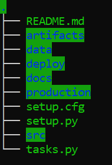
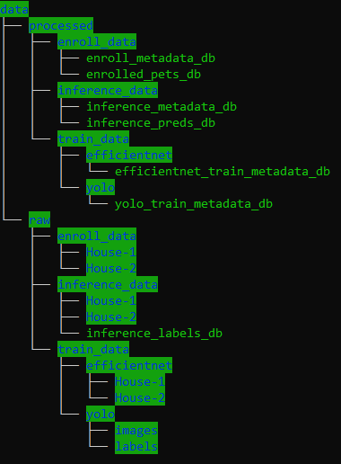
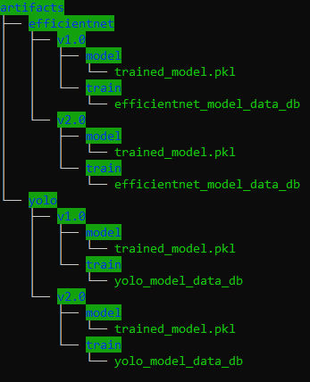

====================
Project Structure
====================

1. Structure of Codebase
====================================

Text color coding in the above structure:
    - Blue with Green background: Directory
    - Green with Black background: file

- ``README.md`` readme file with the project overview and setup instructions.

- ``artifacts`` directory contains the model binaries.

- ``data`` directory contains the raw and processed datasets.

- ``deploy`` directory contains the project environment files.

- ``docs`` directory contains the project documentation.

- ``production`` enrollment and inference process execution utilities.

- ``setup.cfg`` config file for code formatting.

- ``setup.py`` setup file for ``ta_pet_id`` module.

- ``src`` directory contains source code under ``ta_pet_id`` module.

- ``tasks.py`` contains list of project's tasks (environment setup, testing, installing dependencies etc.)

2. Data Folder Structure
=============================

- ``raw`` raw data for enrollment, inference and training data for EfficientNetB2 and YOLOv5

- ``processed`` contains metadata for enrollment, inference and training.

3. Artifacts Folder Structure
==================================

- ``efficientnet`` contain efficientNetB2 model binaries and model data.

- ``yolo`` contains YOLOv5 model binaries and model data.

