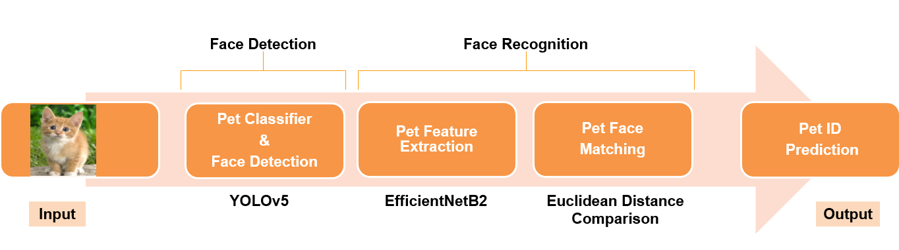
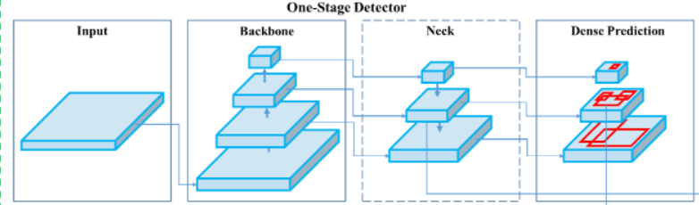
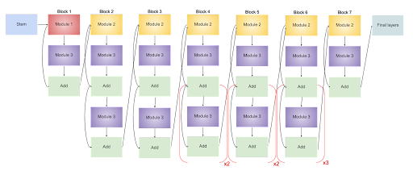
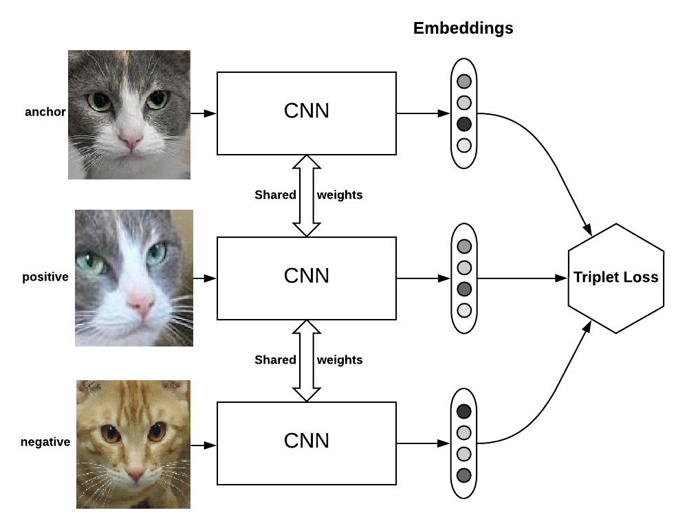
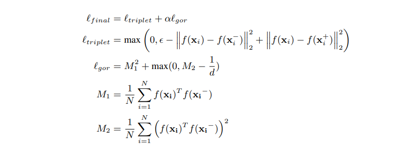
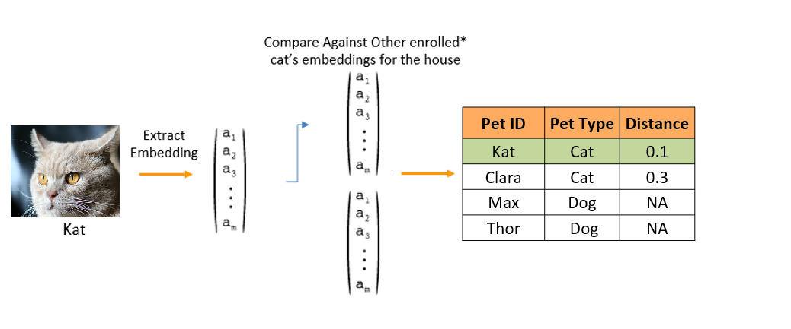

======================
Solution Approach
======================

.. toctree::
   :numbered:

1. Pet Recognition Pipeline
=============================
The image is passed to face detection module followed by face recognition module.

YOLOv5 and EfficientNetB2 models were used for face detection and face recognition respectively.

Pet Recognition consists of 2 stage process.

- Face detection
- Face recognition

2. Face Detection
===========================

Face detection is an object detection technique of detecting multiple objects in an image and comprises of both object localization and object classification.
In this case the YOLOv5 model locates the pet face and classifies the same as a cat or dog.
The model finds multiple face locations and then selects the face location with maximum probability.

2.1 Model Network Details
------------------------------
As mentioned in the project overview section,the model used for face-detection is YOLO-V5
The network architecture of YOLOv5 consists of three parts:

    1. Backbone: CSPDarknet, to extract features
    2. Neck: PANet, to create feature pyramid
    3. Dense Prediction: fully convolutional network, to give prediction boxes

Backbone model is used to extract key features from an input image.The Model Neck is used to
create feature pyramids.Feature pyramids aid models in generalizing successfully when it comes to object scaling.
The model Head is responsible for the final detection step.

The image is first fed as input to CSPDarknet for feature extraction, and then fed to PANet for feature fusion.
Finally, Yolo Layer outputs detection results (class, score, location).

Full model architecture is visualized below.

.. image:: images/solution_approach/yolov5_architecture.jpg
    :width: 100%

.. note::
    For more details, refer `original implementation for YOLOv5. <https://github.com/ultralytics/yolov5>`_

2.2 Model Adaption
--------------------------
The YOLOv5 model was initialized with pre-trained weights based on the training with `COCO dataset <https://cocodataset.org/#home>`_ over 80 different object classes.

In order to be able to detect just cat and dog, we set number of classes to be predicted to 2 in the last layer.

2.3 Model Loss function
--------------------------
    Since our task consists of both classification(cat/dog/background) and regression(bounding box of face), following loss functions were combined .

    - Coordinate loss - to make sure if predicted box is exactly overlapping with the true label
    - Objectness loss - to make sure if any of the objects is present or it's purely background image.
    - Classification loss - to make sure if model predict correct label to the object.

    The individual loss functions are scaled by differing loss coefficients to get a single loss value.

2.4 Model Input and Output
----------------------------
The model input is an image of size 256x256 and following are the outputs:

    - Bounding box co-ordinates of the detected faces(center of face, width and height of face).
    - Box confidence score - probability that bounding box contains the classified object.
    - Type of detected pet(cat or dog in our case).

    .. image:: images/solution_approach/face_detection_input_output.png
      :align: center

3. Face Recognition
============================
In face recognition step, the embeddings are extracted from the cropped face image. These embeddings are compact feature representation of the pet face.We use these embeddings these to compare 2 pet images.

3.1 Feature Extraction
----------------------------
EfficientNetB2 model is selected for feature extraction.

3.1.1 Model Network Details
^^^^^^^^^^^^^^^^^^^^^^^^^^^^^^^^^^^^

EfficientNet is a convolutional neural network that scales all dimensions(depth, width & resolution ) uniformly using a constant multiplicative factor unlike conventional networks uses arbitrary scales which make them too wide, too deep or too high res. ,which saturates those models quickly.

.. note::
    For more details refer `original implementation for EfficientNetB2. <https://arxiv.org/pdf/1905.11946.pdf>`_

3.1.2 Model Adaption
^^^^^^^^^^^^^^^^^^^^^^^^^^^^^^^^^^^^

The EfficietNetB2 model was initialized with pre-trained weights based on the training with `ImageNet dataset <https://image-net.org/>`_.

All layers after final global average pooling layer are removed and a Dense layer of shape 64 is appended.
This layer is then L2 normalized.

3.1.3 Model Loss function
^^^^^^^^^^^^^^^^^^^^^^^^^^^^^^^^^^^^
Triplet loss function with global orthogonal regularization was used to help model learn face embeddings.

.. image:: images/solution_approach/triplet_loss.png
    :width: 45%

The loss function is composed of 2 losses i.e triplet loss and "global orthogonal regularization".

Triplet loss involves an anchor example and one positive or matching example (same class) and one negative or non-matching example (differing class).
The loss function penalizes the model such that the distance between the matching examples is reduced and the distance between the non-matching examples is increased.

After triplet loss model learns to represent positive image and anchor image as close as possible in feature space and try to separate anchor and negative image as far as possible.

3.1.4 Model Input and Output
^^^^^^^^^^^^^^^^^^^^^^^^^^^^^^^^^^^^
EfficientNet inputs an image of size 256x256 and returns a 64-dimensional embedding vector.

    .. image:: images/solution_approach/face_rec_embed.png

.. note::
    Enrolling will be covered in he following section: :ref:`Enrollment`

3.2 Feature Matching
-------------------------
Euclidean distance between the pet embeddings are computed. The pet with the minimum euclidean distance is taken as the predicted pet.

